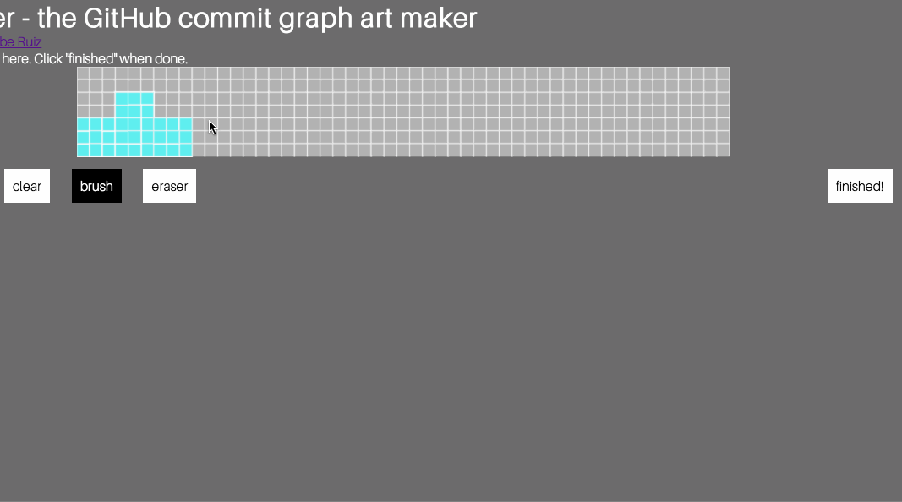
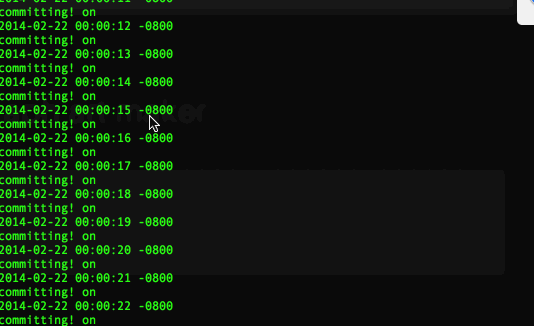
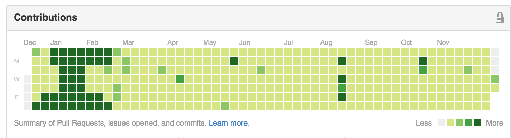

# künstler

An easy GitHub commit graph art generator. By [Gabriel Ruiz](https://github.com/gruiz17). Original source code is [here](https://github.com/gruiz17/kunstler) if you are cloning this.

Use the Canvas tool to make your art...

Watch the commits in action...

...and boom! Your GitHub commit graph looks fancy (note: I already had some art I forgot about in the location I planted the new art, whoops)!

# Usage

* Fork this to your profile and clone this repo to your machine.
* `bash kunstler.sh`
* Go to whatever port sinatra runs on in your browser.
* Use the canvas tool to input your desired pattern.
* Enjoy the magic.

# TODO

* Refinements
* Figure out how to reverse commits

# LICENSE

MIT
